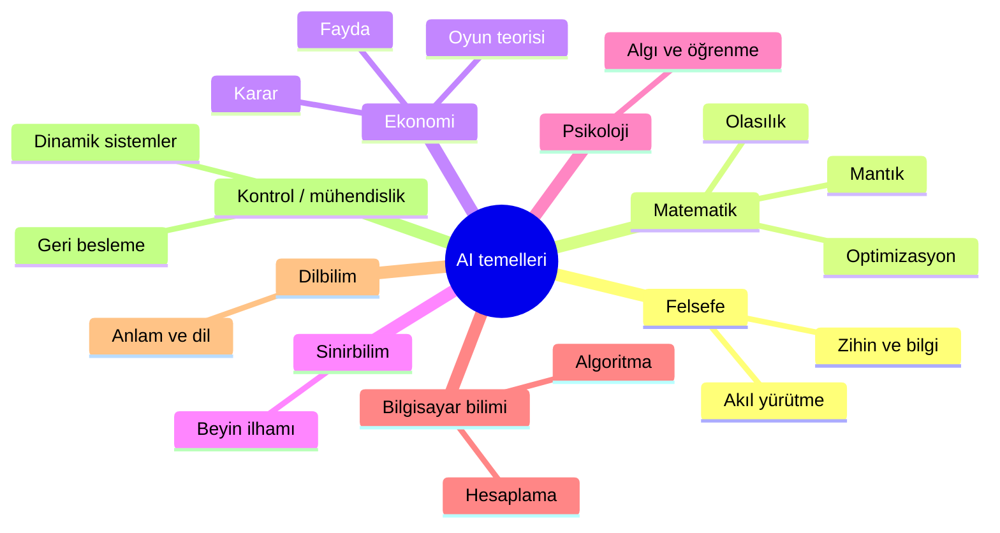
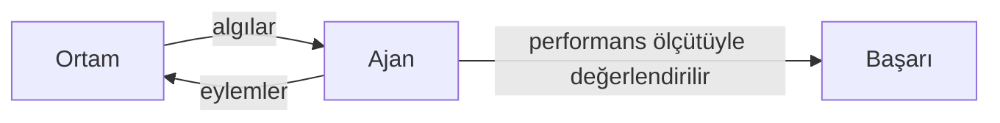
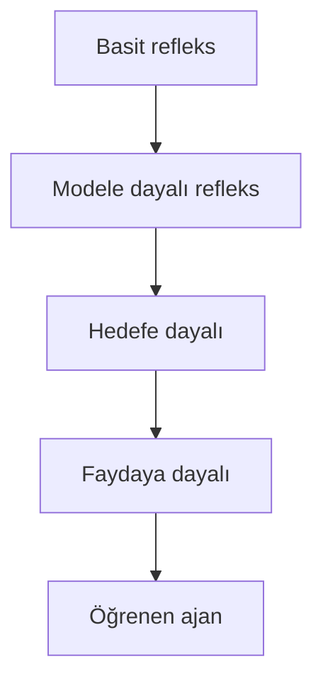

# Bölüm 1 — Giriş: Özgün Notlar

> Bu notlar kitabın metninin kopyası değildir. Kavramları Türkçe, kendi cümlelerimizle öğretir.

---

## 1. Yapay zekâ nedir?

Gündelik dilde “AI” çoğu zaman “akıllı görünen yazılım” anlamına gelir. Teknik çalışmada ise daha net sorular sorarız:

| Soru | Odak |
|------|------|
| İnsan gibi mi **düşünüyor**? | İç süreç, muhakeme modeli |
| İnsan gibi mi **davranıyor**? | Dışarıdan gözlenen başarı (ör. Turing testi tarzı) |
| **Rasyonel** mi düşünüyor? | Mantık / tutarlı çıkarım |
| **Rasyonel** mi davranıyor? | Hedefe göre “iyi” eylem seçimi |

Bu derste ağırlık, **rasyonel davranan ajan** fikrindedir: çevre hakkında algı alır, eylem seçer ve performans ölçütüne göre mümkün olduğunca iyi sonuç üretmeye çalışır. “İnsan gibi” olmak zorunlu hedef değildir; **doğru işi, doğru zamanda yapmak** daha merkezîdir.

**Kısa tanım (çalışma için):**  
*Yapay zekâ; bir ortamda algılayıp eyleyerek, verilen başarı ölçütüne göre iyi performans göstermeyi amaçlayan hesaplamalı sistemlerin bilimidir.*

---

## 2. Temeller (kısa harita)

AI tek bir laboratuvardan doğmadı; birçok alandan kavram ödünç alır:

Pratikte: bir chatbot **dil + öğrenme**, bir satranç motoru **arama + değerlendirme**, bir otonom araç **algı + karar + kontrol** birleşimidir.

---

## 3. Tarihçe — çok kısa çerçeve

Ayrıntılı kronoloji kitaptadır; burada sadece **dönem duygusu** yeter:

1. **Fikirler ve erken dönem** — “makine düşünebilir mi?” soruları, mantık makineleri, erken programlar.
2. **Sembolik / kural dönemi** — bilgiyi açık kurallarla temsil etme; uzman sistemler.
3. **Zorluklar** — ölçek, belirsizlik, gerçek dünya gürültüsü; aşırı iyimser vaatler.
4. **Olasılık ve karar** — belirsizlikle yaşamak; Bayesçi ve karar-teorik yaklaşımlar.
5. **Veri ve öğrenme dönemi** — büyük veri, istatistiksel öğrenme, derin öğrenme; algı ve dilde sıçrama.

Bugün: **hibrit** sistemler yaygındır (öğrenme + arama + kurallar + araç kullanımı).

---

## 4. Akıllı ajan — temel resim

- **Algı (percept):** sensör / girdiden gelen bilgi  
- **Eylem (action):** aktüatör / çıktı ile ortamı değiştirme  
- **Ajan fonksiyonu:** algı geçmişini eyleme eşleyen kural (matematiksel ideal)  
- **Ajan programı:** bu fonksiyonu bilgisayarda gerçekleştiren kod  

İyi ajan = sadece “akıllı görünen” değil; **tanımlı başarı ölçütüne** göre başarılı olan.

---

## 5. PEAS — problemi çerçeveleme

Yeni bir AI görevi tarif ederken PEAS şablonunu doldurun:

| Harf | Anlam | Soru |
|------|--------|------|
| **P** | Performance (başarı ölçütü) | Neyi maksimize/minimize ediyoruz? |
| **E** | Environment (ortam) | Nerede çalışıyor? |
| **A** | Actuators (eyleyiciler) | Ne yapabilir? |
| **S** | Sensors (algılayıcılar) | Ne görebilir / ölçebilir? |

Örnek (özet): **otonom taksi**

- **P:** güvenli varış, süre, yakıt, yolcu konforu, yasal uyum  
- **E:** yollar, trafik, hava, yayalar, diğer araçlar  
- **A:** direksiyon, gaz/fren, sinyal, ekran/ses  
- **S:** kameralar, lidar/radar, GPS, hız, mikrofon  

PEAS net değilse tasarım dağılır: yanlış başarı ölçütü → yanlış davranış.

---

## 6. Ortam özellikleri (sınıflandırma)

Ortamı şu eksenlerde düşünün (çoğu gerçek problem **karışık**tır):

| Özellik | Bir uç | Diğer uç | Sezgi |
|---------|--------|----------|--------|
| Gözlemlenebilirlik | Tam | Kısmi | Her şeyi mi görüyoruz? |
| Determinizm | Deterministik | Stokastik | Aynı eylem hep aynı sonucu mu verir? |
| Epizodiklik | Epizodik | Ardışık | Kararlar birbirini mi etkiler? |
| Dinamiklik | Statik | Dinamik | Düşünürken dünya değişir mi? |
| Süreklilik | Ayrık | Sürekli | Durum/eylem sürekli mi? |
| Ajan sayısı | Tek | Çok | Başkaları da mı var? (işbirliği / rekabet) |
| Bilinen model | Bilinen | Bilinmeyen | Geçiş kurallarını biliyor muyuz? |

**Süpürge dünyası (klasik oyuncak):** küçük, ayrık, çoğu sürümde tam gözlemlenebilir ve deterministik — algoritmayı öğrenmek için ideal.

**Gerçek ev robotu:** kısmi gözlem, gürültü, dinamik, sürekli — çok daha zor.

---

## 7. Ajan türleri (basitten zengine)

### 7.1 Basit refleks ajanı

- Sadece **şu anki algıya** bakar.  
- “Eğer durum X ise eylem Y” kuralları.  
- Bellek yok → kısmi gözlemde kolay yanılır.  
- Örnek: kirliyse süpür, temizse hareket et (bkz. `vacuum_agent.py`).

### 7.2 Modele dayalı refleks ajanı

- Ortamın **iç modelini** (durum tahmini) tutar.  
- “Görmediğim oda muhtemelen hâlâ kirli” gibi çıkarımlar.  
- Hâlâ hedef/fayda yok; kural tabanlı davranış + bellek.

### 7.3 Hedefe dayalı ajan

- Ulaşılacak **hedefler** var (ör. “A ve B temiz olsun”).  
- Arama / planlama ile eylem dizisi seçer.  
- “Ne istiyorum?” sorusu açık.

### 7.4 Faydaya dayalı ajan

- Hedefler yetmez; **ne kadar iyi?** sorusu (fayda / maliyet).  
- Ödünleşim: hızlı varış vs. yakıt vs. güvenlik.  
- Belirsizlikte beklenen fayda düşünülür.

### 7.5 Öğrenen ajan

- Performansı **deneyimle** iyileştirir.  
- Tipik parçalar: performans öğesi (asıl davranış), eleştirmen (geri bildirim), öğrenme öğesi (güncelleme), problem üreteci (keşif).  
- Sabit kuralların yetmediği, değişen ortamlarda kritiktir.

---

## 8. Bu bölümden sonra ne geliyor?

Bölüm 2 ajan fikrini derinleştirir. Bölüm 3’ten itibaren **arama** ile problem çözmeye geçeriz: durumu formüle et, eylemleri dene, hedefe ulaş.

---

## 9. Çalışma ipuçları

1. Her yeni problem için önce **PEAS** yaz.  
2. Ortamı **özellik tablosu** ile sınıflandır.  
3. “Hangi ajan türü yeterli?” diye sor; gerekirse bir üst türe çık.  
4. Oyuncak örnekleri (`vacuum_agent.py`) ile sezgi kazan; sonra gerçekçi senaryoya taşı.

Resmi site: [aima.cs.berkeley.edu](https://aima.cs.berkeley.edu/) · Kod: [aimacode](https://github.com/aimacode)
