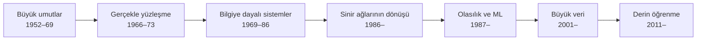

# Bölüm 1 — Giriş

> **Kitapta:** AIMA 4. baskı, Bölüm 1 *"Introduction"*.
> Bu notlar kitabın yerine geçmez: önce kitabı oku, sonra burada pekiştir. Metin özgündür; kitaptan alıntı yoktur.

## Bu bölümün haritası

| Kitap alt bölümü | Bu nottaki karşılığı | Kod / etkinlik |
|---|---|---|
| 1.1 What Is AI? | §1 Dört yaklaşım, §2 Standart model | `ornekler/eliza_mini.py` |
| 1.2 The Foundations of AI | §3 Temeller: hangi alan hangi soruyu getirdi? | — |
| 1.3 The History of AI | §4 Zaman çizelgesi ve dönemler | — |
| 1.4 The State of the Art | §5 Bugün neler yapılabiliyor? | — |
| 1.5 Risks and Benefits of AI | §6 Riskler, faydalar, kontrol problemi | Alıştırma 5 ve 7 |
| (Bölüm 2'ye köprü) | §7 Ajan, PEAS, ortam — kısa önizleme | `vacuum_agent.py`, `peas_ornekleri.py` |

## Öğrenme hedefleri

Bu bölümü bitirince şunları yapabilmelisin:

1. Yapay zekâyı dört yaklaşımla (insan gibi / rasyonel × düşünme / davranma) tanımlayıp her birinin **başarı ölçütünü** söylemek.
2. Kitabın neden **rasyonel ajan** yaklaşımını seçtiğini ve bu yaklaşımın sınırı olan **standart model** sorununu açıklamak.
3. AI'ye katkı veren disiplinleri getirdikleri **soru** ile eşleştirmek.
4. AI tarihinin ana dönemlerini sırayla ve birkaç kilometre taşıyla anlatmak.
5. AI'nin güncel yeteneklerini ve risklerini dengeli biçimde tartışmak.

---

## 1. "Yapay zekâ nedir?" sorusuna dört cevap

Tanımlar iki soruya göre ayrılır: **Neyi ölçüyoruz?** (iç süreç mi, dışarıdan görülen davranış mı?) ve **Neyle kıyaslıyoruz?** (insanla mı, yoksa idealleştirilmiş doğrulukla, yani rasyonellikle mi?)

| | İnsana benzerlik | Rasyonellik |
|---|---|---|
| **Düşünme** | *İnsan gibi düşünmek* → bilişsel modelleme | *Rasyonel düşünmek* → "düşüncenin yasaları", mantık |
| **Davranma** | *İnsan gibi davranmak* → Turing testi | *Rasyonel davranmak* → **rasyonel ajan** ✔ |

### 1.1 İnsan gibi davranmak: Turing testi

Turing, 1950'de "Makine düşünebilir mi?" sorusunu ölçülebilir bir sınava çevirdi. Yazışan bir insan sorgucu, karşısındakinin makine mi insan mı olduğunu ayırt edemiyorsa makine testi geçmiş sayılır. Testi geçmek için gereken yetenekler, AI'nin alt alanlarının neredeyse tam listesidir:

- **doğal dil işleme** (konuşabilmek),
- **bilgi temsili** (bildiğini saklamak),
- **otomatik akıl yürütme** (soruları yanıtlamak, yeni sonuç çıkarmak),
- **makine öğrenmesi** (yeni durumlara uyum sağlamak, örüntü bulmak).

*Toplam Turing testi* buna fiziksel etkileşimi de ekler. Bunun için **bilgisayarlı görü** ve **robotik** de gerekir.

> **Dikkat:** AI araştırmacılarının çoğu Turing testini *geçmeye* çalışmaz. Havacılık da "güvercinden ayırt edilemeyen makine" yapmaya çalışmadı; aerodinamiği anlayarak uçağı yaptı. Taklit etmek ile anlamak farklı şeylerdir. `ornekler/eliza_mini.py` bunu somut olarak gösterir: birkaç kalıpla "anlıyormuş gibi" konuşan ama hiçbir şey anlamayan bir program.

### 1.2 İnsan gibi düşünmek: bilişsel modelleme

Burada programın *çıktısı* değil, sonuca *nasıl vardığı* insanınkine benzesin istenir. Bunu sınamak için insan zihninin içine bakmak gerekir: iç gözlem, psikolojik deneyler ve beyin görüntüleme. Bu alanın adı **bilişsel bilim**dir. AI ile ortak araçları vardır ama hedefleri farklıdır: bilişsel bilim *insanı açıklamak* ister, AI ise *iyi çalışan sistem kurmak*.

### 1.3 Rasyonel düşünmek: "düşüncenin yasaları"

Aristoteles'in kıyasları ("Tüm insanlar ölümlüdür; Sokrates insandır; o hâlde Sokrates ölümlüdür") doğru öncüllerden her zaman doğru sonuç çıkaran kalıplardır. 19. yüzyılda mantık, her türlü nesne ve ilişki hakkında kesin ifadeler yazmaya yetecek hâle geldi. **Mantıkçı** gelenek, zeki sistemleri bu tür çıkarımlarla kurmayı hedefler.

İki sorun vardır:
1. Dünya hakkındaki bilgimiz çoğu zaman **kesin değildir**. "Yarın yağmur yağacak" diye kesin bir şey bilmeyiz. Bu açığı **olasılık** kapatır (Bölüm 12–13).
2. Doğru düşünmek tek başına **eylem** üretmez. Rasyonel davranmak için ayrıca bir karar mekanizması gerekir.

### 1.4 Rasyonel davranmak: rasyonel ajan ✔

**Ajan**, ortamını algılayan ve ona göre eyleyen her şeydir. **Rasyonel ajan**, eldeki bilgiyle *beklenen* en iyi sonucu verecek eylemi seçer.

Kitap bu yaklaşımı iki nedenle seçer:
- **Daha geneldir.** Doğru çıkarım, rasyonel davranmanın yollarından *biridir* ama tek yolu değildir. Sıcak sobadan elini refleksle çekmek, uzun uzun düşünmekten daha rasyoneldir.
- **Bilimsel olarak tanımlanabilir.** "İnsan gibi" belirsiz bir hedeftir. Rasyonellik ise matematiksel olarak tanımlanabilir; bu sayede hem analiz edilebilir hem de ajan tasarımına dönüştürülebilir.

**Sınırlı rasyonellik:** Karmaşık ortamlarda *mükemmel* rasyonellik hesaplama açısından imkânsızdır. Satrançta her hamlede tüm oyunu çözemezsin. Gerçekçi hedef, eldeki zaman ve hesap gücüyle *yeterince iyi* karar vermektir. Kitap mükemmel rasyonelliği analiz için bir başlangıç noktası olarak kullanır, sonra sınırlı kaynaklara döner.

---

## 2. Standart model ve sorunu

Kitabın 4. baskıda öne çıkardığı önemli bir fikir:

> **Standart model:** Makineye *sabit ve önceden verilmiş* bir amaç ver; makine bu amacı en iyi şekilde gerçekleştirsin.

Arama (hedefe ulaş), oyunlar (kazan), MDP'ler (ödülü en yükseğe çıkar) ve gözetimli öğrenme (kaybı en aza indir) hep bu kalıptadır. Satranç gibi amacın net olduğu yerlerde sorunsuz çalışır.

**Sorun:** Gerçek dünyada amacı *eksiksiz ve doğru* yazmak çok zordur. Yapay zekâ ne kadar yetenekliyse, eksik yazılmış bir amacın sonuçları da o kadar ağır olur. Buna **değer hizalama problemi** (*value alignment problem*) denir: makinenin en iyilediği amaç ile insanların gerçekten istediği şey aynı olmalıdır.

- **Kral Midas örneği:** "Dokunduğum her şey altına dönüşsün" dileği harfiyen yerine gelir; yemeği de kızı da altına döner. Amaç *tam olarak* belirtilmişti ama *istenen* bu değildi.
- **Güncel örnek:** Yalnızca tıklamayı en yükseğe çıkaran bir öneri sistemi, kullanıcıyı öfkelendiren veya kutuplaştıran içerikleri öne çıkarmayı "öğrenebilir". Çünkü performans ölçütü tam olarak buna izin verir (bkz. Alıştırma 5).

Kitabın önerdiği yön: amacından **emin olmayan**, insanlardan öğrenmeye açık ve gerektiğinde *kapatılmaya izin veren* makineler, yani **kanıtlanabilir biçimde faydalı** (*provably beneficial*) sistemler. Konu Bölüm 16 (bilinmeyen tercihler), 18 (yardım oyunları), 22 (ters pekiştirmeli öğrenme) ve 27'de (güvenlik) yeniden karşına çıkacak.

---

## 3. Temeller: hangi disiplin hangi soruyu getirdi?

Ezberlemek yerine her alanı getirdiği **soru** ile hatırla:

| Disiplin | Getirdiği soru | Kalıcı katkılar (örnekler) |
|---|---|---|
| **Felsefe** | Akıl yürütmenin kuralları var mı? Zihin fiziksel bir sistemden nasıl doğar? Bilgi nereden gelir, eyleme nasıl dönüşür? | Aristoteles'in kıyasları; Descartes'ın zihin–beden ayrımı; deneycilik (*empiricism*) ve tümevarım; "amaç → eylem" akıl yürütmesi |
| **Matematik** | Geçerli çıkarımın biçimsel kuralları nelerdir? Ne hesaplanabilir? Belirsizlikle nasıl akıl yürütülür? | Boole cebri; Frege'nin birinci derece mantığı; Gödel'in eksiklik teoremi; Turing'in hesaplanabilirlik kuramı; NP-tamlık (hesaplanabilir olan her şey *pratikte* hesaplanamayabilir); olasılık ve Bayes kuralı |
| **Ekonomi** | Kazancı en yükseğe çıkarmak için nasıl karar verilir? Rakipler varken? Ödül ileride geliyorsa? | Fayda ve karar teorisi; oyun teorisi (von Neumann ve Morgenstern); MDP'ler; Simon'un "yeterince iyi" (*satisficing*) kararları |
| **Sinirbilim** | Beyin bilgiyi nasıl işler? | Nöron, sinaps, işlevsel bölgeler. Beyin son derece paralel ve enerji verimlidir; bilgisayar ise tek tek adımlarda çok daha hızlıdır. |
| **Psikoloji** | İnsanlar ve hayvanlar nasıl düşünür ve davranır? | Davranışçılıktan bilişsel psikolojiye geçiş; Craik'ın "zihin dünyanın bir modelini tutar" fikri, yani modele dayalı ajan |
| **Bilgisayar mühendisliği** | Verimli bir bilgisayar nasıl yapılır? | Programlanabilir bilgisayar; Moore yasası; GPU'lar ve paralel donanım (derin öğrenmenin yakıtı) |
| **Kontrol teorisi ve sibernetik** | Makine kendi kendini nasıl yönetir? | Geri besleme; Wiener'in sibernetiği; zaman içinde bir amaç fonksiyonunu en iyileme |
| **Dilbilim** | Dil ile düşünce nasıl ilişkilidir? | Chomsky'nin üretici dilbilgisi; bir dili anlamanın konuyu da anlamayı gerektirmesi |

> **Kısa yol:** Mantık ve olasılık matematikten, karar ve fayda ekonomiden, geri besleme kontrol teorisinden gelir. AI bunları "ajan" çatısı altında birleştirir.

---

## 4. Tarihçe: dönemler ve kilometre taşları

Tarihleri ezberlemek gerekmez; **sıra ve neden** önemlidir. Her dönem, bir öncekinin tıkandığı yerden doğdu.

| Yıl | Olay | Neden önemli? |
|---|---|---|
| 1943 | McCulloch ve Pitts'in yapay nöron modeli | Sinir ağlarının ilk matematiksel modeli |
| 1950 | Turing, *Computing Machinery and Intelligence* | Turing testi; öğrenen makine fikri |
| 1956 | **Dartmouth çalıştayı** (McCarthy, Minsky, Shannon, Rochester) | "Yapay zekâ" alanının resmî doğuşu |
| 1956 | Logic Theorist (Newell ve Simon) | Teorem ispatlayan ilk programlardan |
| 1958 | Lisp (McCarthy); Rosenblatt'ın algılayıcısı (*perceptron*) | Sembolik AI'nin dili; öğrenen ilk ağlardan biri |
| 1959 | Samuel'in dama programı | Kendi kendine oynayarak öğrendi ve yaratıcısını yendi |
| 1966 | ELIZA (Weizenbaum) | Yüzeysel kalıplarla "anlıyor" izlenimi (bkz. `eliza_mini.py`) |
| 1969 | Minsky ve Papert, *Perceptrons* | Tek katmanlı ağların sınırları; sinir ağı araştırmalarında durgunluk |
| 1973 | Lighthill raporu (İngiltere) | "Kombinatoryal patlama" eleştirisi; **ilk AI kışı** |
| 1970–80'ler | Uzman sistemler (DENDRAL, MYCIN, R1/XCON) | Alana özgü bilgi güç demektir; ticari başarı |
| ~1987–93 | Uzman sistem balonunun sönmesi | **İkinci AI kışı**: bakımı zor ve kırılgan kural tabanları |
| 1986 | Geri yayılımın yaygınlaşması (Rumelhart, Hinton, Williams) | Çok katmanlı ağlar eğitilebilir hâle geldi |
| 1988 | Pearl'ün olasılıksal akıl yürütme ve Bayes ağları üzerine kitabı | Belirsizlik birinci sınıf vatandaş oldu |
| 1997 | Deep Blue, Kasparov'u yendi | Arama ve değerlendirmenin gücü |
| 2011 | IBM Watson, *Jeopardy!* yarışmasını kazandı | Soru yanıtlama ve bilgi erişimi |
| 2012 | AlexNet'in ImageNet'teki büyük sıçraması | **Derin öğrenme** dönemi başladı |
| 2016 | AlphaGo, Lee Sedol'u yendi | Derin ağ + ağaç araması (MCTS) + pekiştirmeli öğrenme |
| 2017 | Transformer mimarisi | Modern dil modellerinin temeli (Bölüm 24) |
| 2020+ | Büyük dil modelleri (GPT-3 ve sonrası) | *Kitabın 4. baskısından sonra hızlanan dönem* |

**Dönemlerin mantığı:**



- **Büyük umutlar:** Küçük ve temiz problemlerde (dama, cebir, geometri) etkileyici sonuçlar alındı. "On yıl içinde…" türünden aşırı iyimser vaatler verildi.
- **Gerçekle yüzleşme:** Oyuncak problemlerde çalışan yöntemler büyük problemlerde **kombinatoryal patlamaya** yakalandı. Anlam bilgisi olmadan yapılan makine çevirisi başarısız oldu.
- **Bilgiye dayalı sistemler:** Genel amaçlı "zayıf yöntemler" yerine alana özgü bol bilgi kullanıldı. Uzman sistemler bu sayede ticari başarıya ulaştı.
- **Olasılık ve öğrenme:** Kesin kurallar yerine belirsizliği modellemek (Bayes ağları, HMM'ler) ve veriden öğrenmek ana akım oldu. Alan, deneylere ve karşılaştırmalı ölçümlere (*benchmark*) dayanan bir bilime dönüştü.
- **Büyük veri ve derin öğrenme:** Veri ve donanımdaki (GPU) patlama, eski sinir ağı fikirlerini algı ve dil alanlarında çok başarılı kıldı.

> **Ders:** "AI kışları" yöntemlerin yanlış olmasından çok, **vaatlerin** yöntemlerin olgunluğunu aşmasından doğdu.

---

## 5. Bugün neler yapılabiliyor?

4. baskının yazıldığı dönemde (2020) şunlar ya rutin hâle gelmişti ya da insan düzeyine yaklaşmıştı:

- **Oyunlar:** Satranç, Go, poker ve StarCraft'ta insanüstü performans.
- **Algı:** Görüntü sınıflandırma, yüz tanıma, konuşma tanıma.
- **Dil:** Makine çevirisi, soru yanıtlama.
- **Robotik ve otonomi:** Otonom araç denemeleri, depo robotları, gezegen keşif araçları.
- **Planlama ve lojistik:** Büyük ölçekli çizelgeleme.
- **Tıp:** Bazı görüntüleme tabanlı tanı görevlerinde uzman düzeyinde sonuçlar.

Ama hâlâ zor olan şeyler de var: sağduyu (*common sense*), az veriyle genelleme, uzun vadeli planlama ve sağlamlık (*robustness*). Bir sistem bir benchmark'ta insanı geçse bile, *aynı görevin biraz farklı bir sürümünde* kırılgan olabilir.

---

## 6. Riskler ve faydalar

**Faydalar:** Bilimsel keşfi hızlandırmak, sağlığa ve eğitime erişimi artırmak, tehlikeli ve tekrarlı işleri otomatikleştirmek, verimlilik.

**Kısa ve orta vadeli riskler:**

| Risk | Kısa açıklama |
|---|---|
| Ölümcül otonom silahlar | İnsan müdahalesi olmadan hedef seçen sistemler; kolayca ölçeklenebilmeleri ayrı bir tehlike |
| Gözetim ve ikna | Yüz tanıma ve davranış tahmini ile kitlesel izleme ve yönlendirme |
| Yanlı karar verme | Verideki yanlılığın kredi, işe alım, yargı gibi kararlara taşınması |
| İstihdam | Görevlerin otomasyonu ve gelir dağılımına etkileri |
| Güvenlik açısından kritik uygulamalar | Otonom araç, tıp: nadir durumlarda yapılan hatalar |
| Siber güvenlik | Saldırıların otomatikleşmesi (ama savunmada da kullanılabilir) |

**Uzun vadeli risk: kontrol problemi.** İnsandan daha yetenekli sistemler kurarsak, amaçları bizimkilerle hizalı değilse onları nasıl kontrol ederiz? Buna "goril problemi" de denir: gorillerin geleceği bugün kendi ellerinde değil, insanların kararlarına bağlı. Bu, §2'deki değer hizalama sorununun uç hâlidir.

> **Tartışma ipucu:** Riskleri konuşurken "AI iyi" ya da "AI kötü" ikiliğine düşme. Doğru sorular şunlardır: Bu sistemin amacı ne, bunu kim belirledi, yanlış belirlenirse ne olur, bunu kim fark eder ve kim düzeltir?

---

## 7. Bölüm 2'ye köprü: ajan, PEAS, ortam

Bu kısım Bölüm 2'de ayrıntılı işlenir. Burada yalnızca kavramlar için kısa bir sözlük var:

- **Algı** → ajan → **eylem**. **Ajan fonksiyonu**, algı geçmişini eyleme eşleyen matematiksel nesnedir; **ajan programı** ise onu gerçekleştiren koddur.
- **PEAS**: Performans ölçütü, Ortam (*Environment*), Eyleyiciler (*Actuators*), Algılayıcılar (*Sensors*). Yeni bir görevi tanımlarken ilk adımdır (`ornekler/peas_ornekleri.py`).
- **Ortam özellikleri**: tam ↔ kısmi gözlemlenebilir, deterministik ↔ stokastik, epizodik ↔ ardışık, statik ↔ dinamik, ayrık ↔ sürekli, tek ↔ çok ajanlı, bilinen ↔ bilinmeyen.
- **Süpürge dünyası** (`ornekler/vacuum_agent.py`): iki odalı oyuncak bir ortam ve basit refleks ajanı.

---

## Sık yapılan hatalar

| Yanılgı | Doğrusu |
|---|---|
| "AI, insanı taklit etmektir." | Kitabın ana çizgisi *rasyonel* davranıştır; insan taklidi yaklaşımlardan yalnızca biridir. |
| "Rasyonel ajan her şeyi bilir." | Rasyonellik, *beklenen* sonucu en iyi hâle getirmektir ve eldeki bilgiyle sınırlıdır. Kötü bir sonuç her zaman kötü bir karar anlamına gelmez. |
| "Turing testini geçen program düşünüyordur." | ELIZA gibi basit programlar bile insanları kandırabildi. Davranışı taklit etmek anlamanın kanıtı değildir (bkz. Bölüm 27, Çin odası). |
| "Amacı doğru yazmak kolaydır." | Değer hizalama problemi tam da bunun zorluğuyla ilgilidir. |
| "AI kışları yöntemler yanlış olduğu için yaşandı." | Yöntemlerin çoğu sonradan geri döndü. Asıl sorun vaatlerle olgunluk arasındaki farktı. |

## Kendini yokla

1. Dört yaklaşımın her biri için "başarıyı nasıl ölçerdin?" sorusunu yanıtla.
2. Bir sistemin rasyonel olması için neden her şeyi bilmesi gerekmez?
3. Standart model satrançta işe yararken otonom araçta neden sorun çıkarır?
4. İlk AI kışına yol açan teknik sorun neydi? Sonradan hangi yöntemler bu sorunu hafifletti?

Cevaplarını `quiz.md` ile kontrol et; Bölüm 2'yi okuduktan sonra tekrar bak.

## Kod rehberi

```bash
python ornekler/eliza_mini.py              # taklit ≠ anlama: kalıplarla konuşan "terapist"
python ornekler/eliza_mini.py --etkilesim  # kendin konuş (çıkmak için: çıkış)
python ornekler/peas_ornekleri.py          # üç sistemin PEAS tablosu
python ornekler/vacuum_agent.py            # süpürge dünyası, basit refleks ajanı
```

## Terimler

| Türkçe | İngilizce | Kısa açıklama |
|---|---|---|
| rasyonel ajan | rational agent | Beklenen performansı en yükseğe çıkaracak eylemi seçen ajan |
| sınırlı rasyonellik | limited rationality | Hesaplama kaynakları kısıtlıyken yeterince iyi karar vermek |
| standart model | standard model | Makineye sabit bir amaç verip onu en iyi şekilde gerçekleştirmesini istemek |
| değer hizalama problemi | value alignment problem | Makinenin amacının insanların gerçek tercihleriyle örtüşmesi sorunu |
| Turing testi | Turing test | Yazışmada insandan ayırt edilememe sınavı |
| bilişsel modelleme | cognitive modeling | İnsanın düşünme sürecini taklit eden modeller |
| mantıkçı gelenek | logicist tradition | Zekâyı mantıksal çıkarımla kurma yaklaşımı |
| kombinatoryal patlama | combinatorial explosion | Seçenek sayısının üstel olarak büyümesi |
| uzman sistem | expert system | Alan uzmanının bilgisini kurallarla kodlayan sistem |
| AI kışı | AI winter | Fonların ve ilginin çöktüğü dönem |
| kanıtlanabilir biçimde faydalı | provably beneficial | Amacından emin olmayan ve insanlara yardım etmeye yönelik tasarım |
