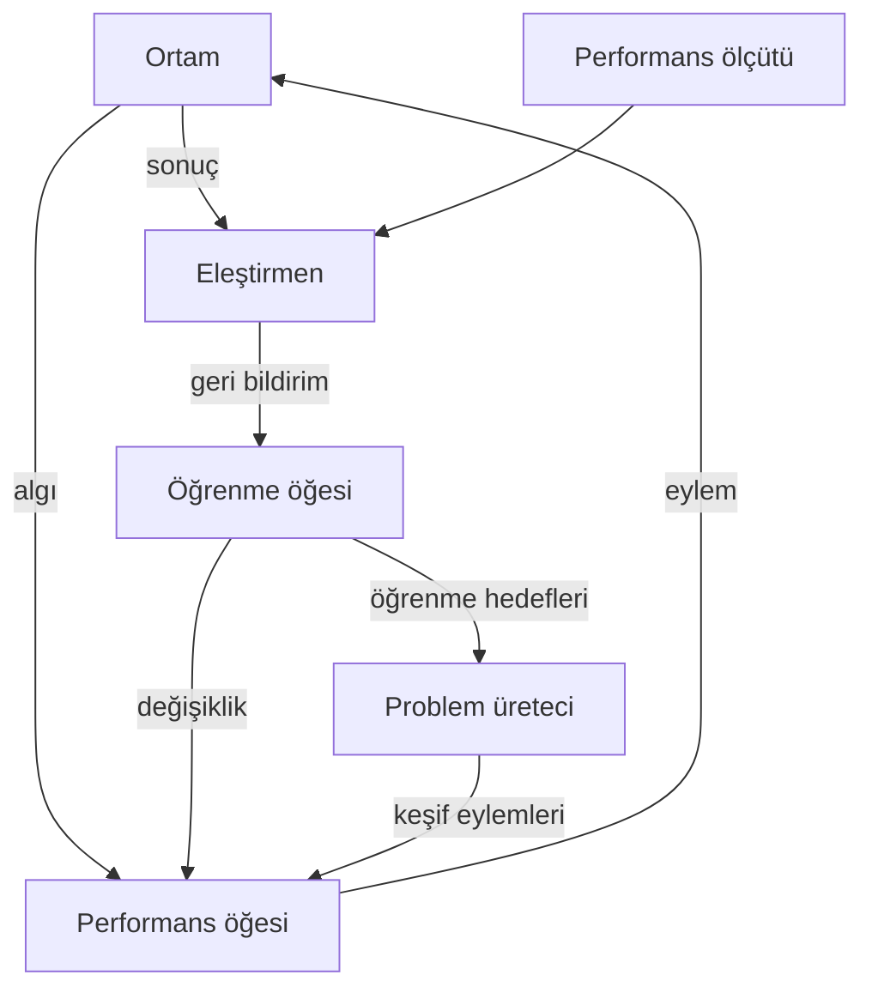

# Bölüm 2 — Akıllı ajanlar

> **Kitapta:** AIMA 4. baskı, Bölüm 2 *"Intelligent Agents"*.
> Önce kitabı oku, sonra bu notlarla pekiştir. Metin özgündür; kitaptan alıntı yoktur.

## Bu bölümün haritası

| Kitap alt bölümü | Bu nottaki karşılığı | Kod |
|---|---|---|
| 2.1 Agents and Environments | §1 Ajan, algı dizisi, ajan fonksiyonu ve programı | `tablo_ajan.py` |
| 2.2 Good Behavior: The Concept of Rationality | §2 Rasyonellik, performans ölçütü, her şeyi bilmek ≠ rasyonellik | `performans_olcutu.py` |
| 2.3 The Nature of Environments | §3 PEAS ve ortam özellikleri | — |
| 2.4 The Structure of Agents | §4 Beş ajan mimarisi, §5 Öğrenen ajan, §6 Temsil türleri | `model_based_vacuum.py`, `ajan_mimarileri_karsilastirma.py` |

## Öğrenme hedefleri

1. Ajan fonksiyonu ile ajan programını ayırt etmek; tabloya dayalı ajanın neden pratik olmadığını hesapla göstermek.
2. Rasyonelliği dört öğesiyle (ölçüt, ön bilgi, eylemler, algı dizisi) tanımlamak; rasyonellik ile her şeyi bilmeyi ayırmak.
3. İyi bir performans ölçütü tasarlamak ve kötü ölçütlerin nasıl istismar edildiğini göstermek.
4. Bir görev ortamını PEAS ve yedi özellik ekseniyle sınıflandırmak.
5. Beş ajan mimarisini ve öğrenen ajanın dört parçasını açıklamak; atomik, ayrışık ve yapılandırılmış temsilleri ayırt etmek.

---

## 1. Ajanlar ve ortamlar

**Ajan**, ortamını **algılayıcılar** (*sensors*) ile algılayan ve **eyleyiciler** (*actuators*) ile ortamı etkileyen her şeydir. İnsan, robot, termostat ve yazılım botu, hepsi bu çerçeveye girer.

- **Algı** (*percept*): Ajanın bir anda aldığı girdi.
- **Algı dizisi** (*percept sequence*): Ajanın o ana kadar aldığı **tüm** algıların geçmişi. Ajanın seçimi, bu diziye ve yerleşik bilgisine bağlı olabilir, *görmediği* hiçbir şeye bağlı olamaz.
- **Ajan fonksiyonu**: Her olası algı dizisini bir eyleme eşleyen matematiksel tanım. Soyuttur; "ne yapılmalı?" sorusunu yanıtlar.
- **Ajan programı**: Bu fonksiyonu fiziksel bir makinede (mimari) gerçekleştiren somut kod.

> **Ajan = mimari + program**

### Tabloya dayalı ajan: işe yaramayan ama öğretici fikir

Ajan fonksiyonunu doğrudan bir tabloya yazabilirsin: Anahtar algı dizisi, değer eylem olur. Sorun **boyuttur**. |P| farklı algı ve T adımlık ömür için tablo

$$\sum_{t=1}^{T} |P|^t$$

satır içerir. `ornekler/tablo_ajan.py` bunu hesaplıyor: süpürge dünyasındaki 4 algı ile 100 adımda tablo yaklaşık **10⁶⁰** satıra ulaşır. Gözlemlenebilir evrendeki atom sayısı ise yaklaşık 10⁸⁰'dir. Kameralı bir robotta sayılar hayal edilemeyecek kadar büyür.

**Ders:** AI'nin asıl sorusu, rasyonel davranışı dev bir tablodan değil, **küçük bir programdan** üretmektir. Tıpkı karekök tablolarının yerini birkaç satırlık Newton yönteminin alması gibi.

---

## 2. İyi davranış: rasyonellik

### 2.1 Performans ölçütü

Ajanın davranışı ortamı bir **durum dizisinden** geçirir. Bu dizinin ne kadar iyi olduğunu **performans ölçütü** söyler. Ölçüt ajanın içinde değil, **tasarımcının** elindedir.

> **Altın kural:** Performans ölçütünü, ajanın *nasıl davranmasını* istediğine göre değil, **ortamda gerçekte ne olmasını** istediğine göre tasarla.

`ornekler/performans_olcutu.py` bu kuralı somut olarak gösterir. Ölçüt "süpürülen toz miktarı" olursa, tozu yere döküp tekrar süpüren **hileci ajan** kazanır (20 adımda 10 puan, dürüst ajan 2 puan). Ölçüt "her adımda temiz oda sayısı" olursa dürüst ajan kazanır (38 puana 10). İstediğimiz şey temiz zemindir; ölçüt de onu ölçmelidir.

Ölçüt tasarımında zor sorular da vardır: Ortalama temizlik mi, en kötü an mı önemli? Sürekli "biraz kirli" mi daha iyi, bazen "çok kirli" ama çoğu zaman temiz mi? Bunlar felsefi ve etik tercihlerdir (bkz. Bölüm 1, değer hizalama).

### 2.2 Rasyonelliğin tanımı

Herhangi bir anda neyin rasyonel olduğu dört şeye bağlıdır:

1. Başarıyı tanımlayan **performans ölçütü**,
2. Ajanın ortam hakkındaki **ön bilgisi**,
3. Ajanın yapabileceği **eylemler**,
4. Ajanın o ana kadarki **algı dizisi**.

> **Tanım (kendi cümlelerimizle):** Rasyonel ajan, her olası algı dizisi için, algı dizisinin sağladığı kanıtı ve yerleşik bilgisini kullanarak, performans ölçütünün **beklenen** değerini en yükseğe çıkaracak eylemi seçer.

**Süpürge dünyasında örnek.** Varsayımlar şöyle olsun: Ölçüt, 1000 adım boyunca her adımda temiz olan her kare için 1 puan. Haritayı biliyoruz ama kirin nerede olduğunu ve başlangıç konumunu bilmiyoruz. Temizlenen kare temiz kalıyor. Eylemler Sol, Sağ ve Süpür. Konum ve kir doğru algılanıyor. Bu varsayımlar altında basit refleks ajanı (**kirliyse süpür, değilse diğer kareye geç**) rasyoneldir; beklenen puanı hiçbir ajan geçemez.

Varsayımları değiştir: Her **hareket** 1 puan cezaya yol açsın. Artık iş bittikten sonra gidip gelen refleks ajanı rasyonel değildir. Durabilmek için "diğer oda temiz" bilgisini **hatırlaması** gerekir (bkz. `model_based_vacuum.py`). Rasyonellik ajanın değil, **ajan + ortam + ölçüt** üçlüsünün özelliğidir.

### 2.3 Rasyonellik ≠ her şeyi bilmek

- **Her şeyi bilen** (*omniscient*) ajan, eylemlerinin *gerçek* sonucunu bilir. Bu imkânsızdır.
- **Rasyonel** ajan, *beklenen* performansı en iyiler. Yolun karşısına bakıp geçtikten sonra tepene bir uçak parçası düşerse, bu senin kararını irrasyonel yapmaz.

Buradan üç önemli sonuç çıkar:
1. **Bilgi toplama**: Karşıdan karşıya geçmeden önce bakmak rasyoneldir. Gelecekteki algıları iyileştiren eylemler de rasyonelliğin parçasıdır. Bunun ölçüsü, Bölüm 16'daki *bilgi değeri*dir.
2. **Öğrenme**: Rasyonel ajan, deneyimden öğrenerek ön bilgisini düzeltir.
3. **Özerklik** (*autonomy*): Yalnızca tasarımcının ön bilgisine dayanan ajan kırılgandır. Zamanla kendi deneyimine dayanabilen ajan özerktir. Başlangıçta biraz ön bilgi vermek mantıklıdır; evrim de hayvanlara refleksler verir.

---

## 3. Ortamın doğası

### 3.1 PEAS

Bir **görev ortamını** tanımlamak için PEAS kullan: **P**erformans ölçütü, **E**nvironment (ortam), **A**ctuators (eyleyiciler), **S**ensors (algılayıcılar).

| PEAS | Ev temizlik robotu |
|---|---|
| P | Temiz alan oranı, enerji tüketimi, çarpışma olmaması, gürültü sınırı |
| E | Odalar, mobilya, insanlar, evcil hayvan, halılar |
| A | Tekerlekler, fırça/emiş, hoparlör |
| S | Çarpma algılayıcısı, merdiven (uçurum) algılayıcısı, kamera/lidar, batarya ölçer, kir algılayıcısı |

### 3.2 Yedi eksen

| Eksen | Soru | Tasarıma etkisi |
|---|---|---|
| **Tam / kısmi gözlemlenebilir** | Algılayıcılar karar için gereken her şeyi görüyor mu? | Kısmi ise **iç durum / bellek** gerekir. Hiç algılayıcı yoksa ortam *gözlemlenemez*. |
| **Tek / çok ajanlı** | Performansı benimkini etkileyen başka ajan var mı? | **Rekabetçi** (satranç) ya da **işbirlikçi** (araçların çarpışmaması). İletişim ve rastgele davranış anlamlı hâle gelir. |
| **Deterministik / deterministik olmayan** | Durum + eylem, sonraki durumu tam belirliyor mu? | Belirlemiyorsa **olasılık** veya **olasılıklar kümesi** ile düşünülür. |
| **Epizodik / ardışık** | Şimdiki karar gelecekteki kararları etkiliyor mu? | Ardışık ise ileriye bakmak (arama, planlama) gerekir. Bantta hatalı parça ayıklamak epizodiktir; satranç ardışıktır. |
| **Statik / dinamik** | Ajan düşünürken dünya değişiyor mu? | Dinamik ise "karar vermemek de bir karardır". Saatli satranç **yarı dinamiktir**: dünya değişmez ama puan (süre) değişir. |
| **Ayrık / sürekli** | Durum, zaman, algı ve eylem sonlu sayıda mı? | Sürekli ise sayısal ve yaklaşık yöntemler gerekir. |
| **Bilinen / bilinmeyen** | Ajan ortamın "fizik kurallarını" biliyor mu? | Bilinmiyorsa öğrenme ve keşif gerekir. *Gözlemlenebilirlikten farklıdır*: solitaire'de kuralları bilirsin ama kartları göremezsin; yeni bir oyunda ekranı görürsün ama tuşların ne işe yaradığını bilmezsin. |

**İnce ayrım: stokastik ≠ deterministik olmayan.** 4. baskı şöyle ayırır: Model sonuçların **olasılıklarını** açıkça veriyorsa ortam *stokastiktir* ("süpürme %90 ihtimalle başarılı olur"). Yalnızca olası sonuçların **listesi** varsa, olasılıklar yoksa *deterministik olmayan* (*nondeterministic*) denir ("süpürme başarılı olabilir de, olmayabilir de"). Bölüm 4'teki AND-OR araması ikinci türle çalışır; Bölüm 12 ve sonrası birinci türle.

**En zor durum:** kısmi gözlemlenebilir, çok ajanlı, deterministik olmayan, ardışık, dinamik, sürekli ve bilinmeyen. Taksi şoförlüğü, "bilinmeyen" dışındaki bütün zorlukları taşır.

### 3.3 Örnek sınıflandırmalar

| Görev | Gözlem | Ajan | Belirlilik | Epizot | Statik | Ayrık |
|---|---|---|---|---|---|---|
| Sudoku | Tam | Tek | Deterministik | Ardışık | Statik | Ayrık |
| Saatli satranç | Tam | Çok | Deterministik | Ardışık | Yarı | Ayrık |
| Poker | Kısmi | Çok | Stokastik | Ardışık | Statik | Ayrık |
| Tavla | Tam | Çok | Stokastik | Ardışık | Statik | Ayrık |
| Taksi şoförlüğü | Kısmi | Çok | Stokastik | Ardışık | Dinamik | Sürekli |
| Tıbbi teşhis | Kısmi | Tek | Stokastik | Ardışık | Dinamik | Sürekli |
| Bantta parça ayıklayan robot | Kısmi | Tek | Stokastik | Epizodik | Dinamik | Sürekli |
| Dil öğreten asistan | Kısmi | Çok | Stokastik | Ardışık | Dinamik | Ayrık |

> Bu tablo "tek doğru cevap" değildir. Sınırları nasıl çizdiğine göre değişir. Önemli olan her hücreyi **gerekçelendirebilmendir**.

**Ortam üreteci:** Bir ajan tek bir ortamda değil, bir ortam **sınıfında** değerlendirilir. Süpürge dünyasında kirin ve başlangıç konumunun tüm kombinasyonları üzerinden ortalama performans alınır. `vacuum_agent.py`'deki senaryoları çoğaltmak bunun küçük bir örneğidir.

---

## 4. Ajanların yapısı: beş mimari

Tüm ajan programları aynı iskeleti paylaşır: algıyı al → (belki iç durumu güncelle) → eylem döndür.

```text
fonksiyon AJAN-PROGRAMI(algı) → eylem
    kalıcı: durum, model, kurallar, hedefler/fayda (mimariye göre)
    durum ← DURUMU-GÜNCELLE(durum, son_eylem, algı, model)   # modele dayalıdan itibaren
    eylem ← SEÇ(durum, …)
    son_eylem ← eylem
    döndür eylem
```

### 4.1 Basit refleks ajanı

- **Yalnızca şimdiki algıya** bakar: "eğer koşul ise eylem" kuralları.
- **Tam gözlemlenebilir** ortamda çok iyi çalışır. Kısmi gözlemde **sonsuz döngülere** girebilir (konum algılayıcısı olmayan süpürge, sürekli aynı yöne gitmeye çalışır).
- Döngüden kaçmanın bir yolu **rastgelelik**tir. Tek ajanlı ortamda bu çoğu zaman bir iç durum eksikliğinin yamasıdır.

### 4.2 Modele dayalı refleks ajanı

Kısmi gözlemde, **şu an göremediğin** kısmı takip etmek gerekir. İç durumu güncellemek için iki tür bilgi lazım:

- **Geçiş modeli**: Dünya kendiliğinden ve benim eylemlerimle nasıl değişiyor? ("Sola döndüm, o hâlde az önce sağımda olan araç şimdi önümde.")
- **Algılayıcı modeli**: Dünyanın durumu algılarıma nasıl yansıyor? ("Kameradaki kırmızı ışık, öndeki aracın fren yaptığı anlamına gelir.")

İç durum çoğu zaman bir **en iyi tahmindir**. Kısmi gözlemde kesinlik nadiren mümkündür. Olasılıksal hâli Bölüm 14'te (filtreleme) gelecek.

### 4.3 Hedefe dayalı ajan

Aynı durumda "doğru" eylem, **nereye gitmek istediğine** bağlıdır. Hedef bilgisi + model → "bu eylemi yaparsam ne olur, hedefe yaklaşır mıyım?" Bu **arama** (Bölüm 3–5) ve **planlama** (Bölüm 11) demektir. Refleks ajanına göre daha az verimli ama çok daha **esnektir**: Hedef değişince kuralları yeniden yazmak gerekmez.

### 4.4 Faydaya dayalı ajan

Hedefler ikilidir (mutlu / mutsuz). **Fayda fonksiyonu** ise durumları dereceler: daha hızlı, daha güvenli, daha ucuz. İki durumda hedeften daha iyidir:
1. **Çatışan hedefler** varsa (hız ve güvenlik), fayda aradaki ödünleşimi belirler.
2. Hedeflere **kesin ulaşılamıyorsa**, başarı olasılığı hedefin önemiyle tartılır.

Belirsizlik altında rasyonel ajan **beklenen faydayı** en yükseğe çıkarır (Bölüm 16).

### 4.5 Öğrenen ajan

| Parça | Görevi | Taksi örneği |
|---|---|---|
| **Performans öğesi** | Eylem seçer (yukarıdaki ajanlardan herhangi biri) | Direksiyonu, gazı ve freni kontrol eden sürüş programı |
| **Eleştirmen** | Sabit bir ölçüte göre "ne kadar iyi gidiyor?" der | Yolcu bahşiş vermedi, arkadan korna çalındı |
| **Öğrenme öğesi** | Eleştiriye göre performans öğesini değiştirir | "Hızlı şerit değiştirmek kötü sonuç veriyor" kuralını öğrenir |
| **Problem üreteci** | Bilgilendirici yeni deneyimler önerir (keşif) | "Islak zeminde fren mesafesini bir dene" |

Eleştirmenin ölçütü **dışarıdan sabit** olmalıdır. Ajan kendi ölçütünü değiştirebilseydi, standardı düşürerek "başarılı" olurdu. Bu fikir Bölüm 22'de (pekiştirmeli öğrenme, ödül) geri gelir.



### 4.6 Hangisini ne zaman?

| Durum | Önerilen mimari |
|---|---|
| Tam gözlem, basit eşleme | Basit refleks |
| Kısmi gözlem, kurallar yeterli | Modele dayalı |
| Hedef net, yol aranacak | Hedefe dayalı (+ arama) |
| Çok ölçüt / belirsizlik | Faydaya dayalı |
| Ortam bilinmiyor ya da değişiyor | Öğrenen |

---

## 5. Durum temsilleri: atomik → ayrışık → yapılandırılmış

Ajanın dünyayı nasıl temsil ettiği, hangi algoritmaları kullanabileceğini belirler. Kitabın geri kalanı bu üç düzeye göre ilerler.

| Temsil | Durum nedir? | Örnek | Kitapta nerede? |
|---|---|---|---|
| **Atomik** | İç yapısı olmayan bir "kara kutu": sadece adı var | "Arad", "Bucharest" | Arama (3–5), HMM (14), MDP (17) |
| **Ayrışık** (*factored*) | Değişkenlerin (özniteliklerin) değerleri | `{yakıt: %40, konum: (x,y), ışık: yeşil}` | CSP (6), önerme mantığı (7), planlama (11), Bayes ağları (13), çoğu ML (19–21) |
| **Yapılandırılmış** | **Nesneler** ve aralarındaki **ilişkiler** | `Önünde(Kamyon, Ben)`, `Taşıyor(Kamyon, İnek)` | Birinci derece mantık (8–10), birinci derece olasılık modelleri (15), dil (23–24) |

- Temsil **ifade gücü** arttıkça daha kısa açıklamalar mümkün olur. Satrancın kuralları birinci derece mantıkla birkaç sayfaya sığar, önerme mantığıyla binlerce sayfa tutar. Ama akıl yürütme ve öğrenme de daha karmaşık hâle gelir.
- Bir diğer eksen: **yerel** (bir kavram = bir bellek hücresi) ve **dağıtık** (bir kavram = birçok hücreye yayılmış bir örüntü, ör. sinir ağı gömüleri). Dağıtık temsiller gürültüye karşı daha dayanıklıdır (Bölüm 21, 24).

---

## Sık yapılan hatalar

| Yanılgı | Doğrusu |
|---|---|
| "Ajan fonksiyonu ile ajan programı aynı şeydir." | Fonksiyon soyut bir eşlemedir, program onu gerçekleştiren koddur. Birçok program aynı fonksiyonu gerçekleştirebilir, bazı fonksiyonlar ise hiçbir sonlu programla gerçekleştirilemez. |
| "Rasyonel ajan hiç hata yapmaz." | Rasyonellik *beklenen* sonucu en iyiler. Her şeyi bilmek başka bir şeydir. |
| "Ölçütü ajanın davranışına göre yazarım: 'çok süpürsün'." | Ölçüt, istenen *dünya durumunu* ölçmeli (bkz. `performans_olcutu.py`). |
| "Kısmi gözlemlenebilir = bilinmeyen ortam." | Gözlemlenebilirlik *durumu* görmekle ilgilidir, bilinen/bilinmeyen ise *kuralları* bilmekle. İkisi bağımsızdır. |
| "Stokastik ile deterministik olmayan aynı şeydir." | Stokastik ortamda olasılıklar bilinir; deterministik olmayan ortamda yalnızca olasılıkların listesi vardır. |
| "Hedefe dayalı ajan her zaman faydaya dayalı ajandan kötüdür." | Hedef yeterince iyi tanımlanmışsa daha basittir. Fayda, çatışan hedefler ve belirsizlik varsa gerekir. |

## Kendini yokla

1. Süpürge dünyasında basit refleks ajanını irrasyonel yapan **tek bir** varsayım değişikliği söyle.
2. Kör bir satranç oyuncusu (tahtayı görmeyen ama hamleleri duyan) için ortam hangi eksenlerde değişir?
3. Bir ortam kısmi gözlemlenebilir ama bilinen olabilir mi? Tam gözlemlenebilir ama bilinmeyen olabilir mi? Birer örnek ver.
4. Öğrenen ajanda eleştirmenin ölçütü neden ajanın kendisi tarafından değiştirilememeli?

## Kod rehberi

```bash
python ornekler/tablo_ajan.py                   # tablo boyutunun üstel patlaması
python ornekler/performans_olcutu.py            # hileci ajan: yanlış ölçüt istismar edilir
python ornekler/model_based_vacuum.py           # refleks ve modele dayalı ajan karşılaştırması
python ornekler/ajan_mimarileri_karsilastirma.py  # beş mimarinin özet tablosu
```

## Terimler

| Türkçe | İngilizce | Kısa açıklama |
|---|---|---|
| algı / algı dizisi | percept / percept sequence | Anlık girdi / o ana kadarki tüm girdiler |
| ajan fonksiyonu | agent function | Algı dizisi → eylem eşlemesi (soyut) |
| ajan programı | agent program | Ajan fonksiyonunu gerçekleştiren kod |
| performans ölçütü | performance measure | Ortamın durum dizisini değerlendiren ölçüt |
| her şeyi bilen | omniscient | Eylemlerinin gerçek sonucunu bilen (imkânsız ideal) |
| özerklik | autonomy | Tasarımcının ön bilgisi yerine kendi deneyimine dayanabilme |
| görev ortamı | task environment | PEAS ile tanımlanan problem |
| kısmi gözlemlenebilir | partially observable | Algılayıcılar durumun tamamını göstermez |
| stokastik | stochastic | Sonuçların olasılıkları belli |
| deterministik olmayan | nondeterministic | Olası sonuçlar belli, olasılıkları belli değil |
| epizodik / ardışık | episodic / sequential | Kararlar birbirinden bağımsız / birbirini etkiler |
| yarı dinamik | semidynamic | Dünya değişmez ama performans puanı zamanla değişir |
| geçiş modeli | transition model | Eylemlerin ve zamanın dünyayı nasıl değiştirdiği |
| algılayıcı modeli | sensor model | Dünya durumunun algılara nasıl yansıdığı |
| fayda fonksiyonu | utility function | Durumları ne kadar tercih edildiklerine göre puanlar |
| eleştirmen / problem üreteci | critic / problem generator | Öğrenen ajanın geri bildirim ve keşif parçaları |
| atomik / ayrışık / yapılandırılmış temsil | atomic / factored / structured representation | Kara kutu / değişkenler / nesneler ve ilişkiler |
