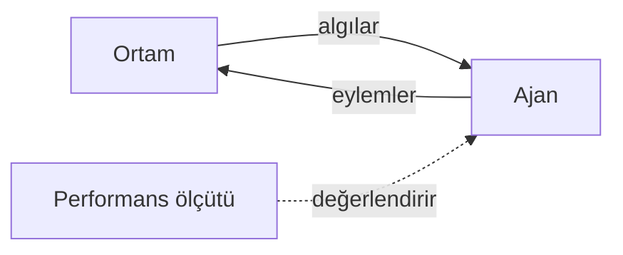
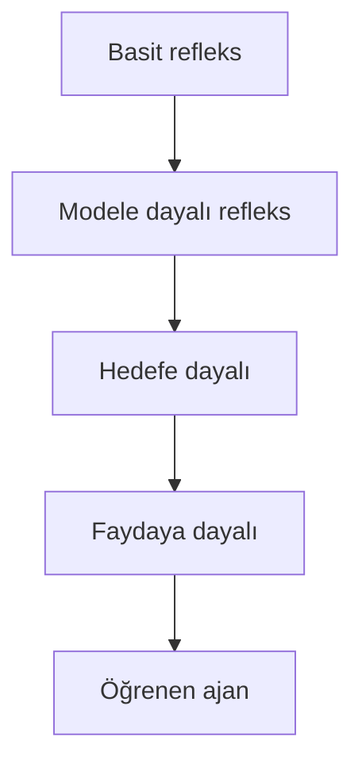
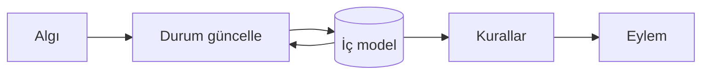
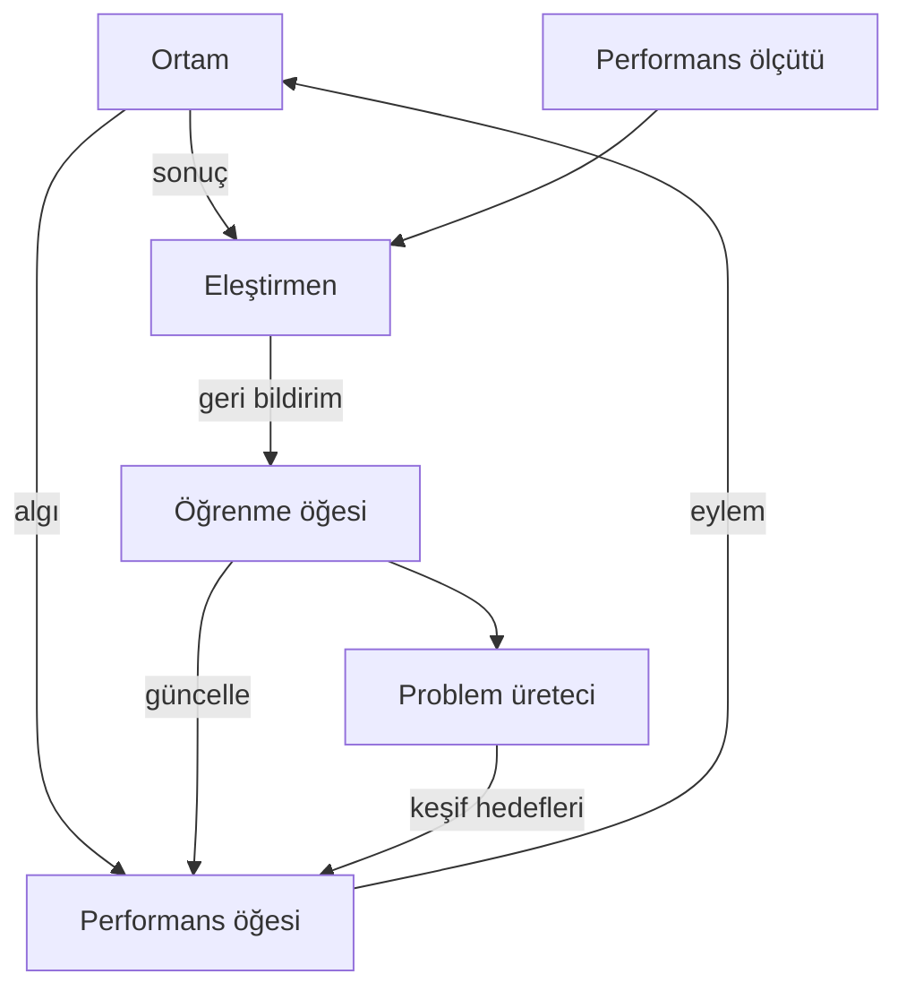

# Bölüm 2 — Akıllı ajanlar: Özgün Notlar

> Bu notlar kitabın metninin kopyası değildir. Kavramları Türkçe, kendi cümlelerimizle öğretir.

---

## 1. Neden “ajan” çerçevesi?

Yapay zekâ uygulamalarını tek tek (chatbot, robot, tavsiye sistemi) ezberlemek yerine ortak bir dil kullanırız: **ajan = algılayan + eyleyen sistem**. Bu dil, problemi parçalamayı kolaylaştırır: neyi ölçüyoruz, neyi görebiliriz, ne yapabiliriz, ortam nasıl?

Bölüm 1’deki resmi hatırlayın:

---

## 2. Ajan fonksiyonu vs ajan programı

İki katmanı ayırmak kritiktir:

| | Ajan fonksiyonu | Ajan programı |
|--|-----------------|---------------|
| Nedir? | Matematiksel eşleme: *algı geçmişi → eylem* | Bu eşlemeyi bilgisayarda koşan kod |
| İdeal | Her olası geçmiş için “doğru” eylem | Bellek, zaman ve hesap sınırlı |
| Soru | “Mükemmel ajan ne yapardı?” | “Bunu nasıl hesaplarız?” |

**Algı geçmişi:** ajanın doğumundan (veya reset’ten) bu yana gördüğü tüm algıların dizisi. Basit refleks ajanı geçmişin sadece son elemanına bakar; modele dayalı ajan geçmişi özetleyen bir **iç durum** tutar.

Pratikte: fonksiyon “ne olmalı?”, program “nasıl kodlanır?”. İyi tasarım, programın fonksiyonu mümkün olduğunca iyi yaklaşık olarak gerçekleştirmesidir.

---

## 3. PEAS’i yeniden ziyaret

Yeni bir görevde yine PEAS doldurun; bu bölümde vurgu **ölçüt–ortam uyumu**:

- **P (Performance):** ölçütü yanlış seçerseniz ajan “akıllı” görünür ama istenmeyeni optimize eder (ör. sadece hız → güvenlik ihmal).
- **E (Environment):** sınıflandırma (aşağıda) mimari seçimini belirler.
- **A / S:** eyleyici ve sensör seti, ajanın *yapabilirlik* sınırını çizer.

**Örnek — ev içi temizlik robotu (özet):**

| PEAS | İçerik |
|------|--------|
| P | Temiz alan oranı, enerji, çarpışma yok, gürültü limiti |
| E | Odalar, mobilya, insanlar, evcil hayvan, kısmi görüş |
| A | Tekerlekler, fırça/emiş, hoparlör |
| S | Çarpışma, cliff, kamera/lidar (sınırlı), batarya |

---

## 4. Ortam özellikleri — daha derin

Her eksen, hangi ajan mimarisinin yeteceğini etkiler:

| Özellik | Sezgi | Tasarım etkisi |
|---------|--------|----------------|
| **Tam / kısmi gözlem** | Her şeyi mi görüyoruz? | Kısmiyse bellek / model şart |
| **Deterministik / stokastik** | Aynı eylem hep aynı sonucu mu? | Stokastikse beklenen değer / risk |
| **Epizodik / ardışık** | Kararlar birbirini etkiler mi? | Ardışıksa planlama veya öğrenme |
| **Statik / dinamik** | Düşünürken dünya değişir mi? | Dinamikse hızlı karar, zaman baskısı |
| **Ayrık / sürekli** | Durum/eylem ayrık mı? | Sürekliyse sayısal / yaklaşık yöntemler |
| **Tek / çok ajan** | Başkaları da mı var? | İşbirliği veya rekabet modeli |
| **Bilinen / bilinmeyen** | Geçiş kurallarını biliyor muyuz? | Bilinmiyorsa öğrenme / keşif |

**Kural of thumb:** kısmi gözlem + ardışık karar → en azından **modele dayalı**; belirsizlik ve ödünleşim → **fayda**; model yok veya değişiyor → **öğrenme**.

---

## 5. Ajan mimarileri

### 5.1 Basit refleks

- Girdi: **şu anki algı** (geçmiş yok).
- Yapı: “eğer koşul → eylem” kuralları.
- Artı: hızlı, anlaşılır.
- Eksi: kısmi gözlemde kör; sonsuz döngüye düşebilir (temiz odalar arasında mekik).

### 5.2 Modele dayalı refleks

- **İç durum:** “dünya şu an nasıl olabilir?” özeti.
- Güncelleme: önceki durum + son eylem + yeni algı → yeni durum tahmini.
- Hâlâ hedef/fayda yok; kurallar iç duruma bakarak seçer.
- Örnek: her iki odanın temizlik bilgisini bellekte tutan süpürge (`model_based_vacuum.py`).

### 5.3 Hedefe dayalı

- Açık **hedef** (ör. “her oda temiz”, “şehir X’e var”).
- Eylem seçimi: arama / planlama — “hangi eylem dizisi hedefe götürür?”
- Bölüm 3’ten itibaren bu mimariyi algoritmalarla doldururuz.

### 5.4 Faydaya dayalı

- Hedef yetmez; sonuçların **ne kadar iyi** olduğu skorlanır (fayda).
- Ödünleşim: süre vs yakıt vs güvenlik.
- Belirsizlikte: beklenen fayda.

### 5.5 Öğrenen ajan

Sabit kurallar yetmediğinde ajan deneyimle kendini iyileştirir. Tipik dört parça:

| Parça | Rol |
|-------|-----|
| **Performans öğesi** | Asıl davranış (şu anki “ajan programı”) |
| **Eleştirmen** | Performansı ölçüte göre değerlendirir; geri bildirim üretir |
| **Öğrenme öğesi** | Geri bildirime göre performans öğesini günceller |
| **Problem üreteci** | Keşif için yeni deneyimler önerir (“bunu dene”) |

---

## 6. Hangisini seçmeliyim?

| Durum | Önerilen mimari |
|-------|-----------------|
| Tam gözlem, basit eşleme | Basit refleks |
| Kısmi gözlem, kurallar yeterli | Modele dayalı |
| Hedef net, yol aranacak | Hedefe dayalı (+ arama) |
| Çok ölçüt / belirsizlik | Faydaya dayalı |
| Ortam değişiyor / model yok | Öğrenen |

Karşılaştırma tablosu için: `python ornekler/ajan_mimarileri_karsilastirma.py`

---

## 7. Bu bölümden sonra

Bölüm 3’te hedefe dayalı ajanın “beyni” olan **arama**ya geçeriz: durumu formüle et, ağaç/graf üzerinde BFS, DFS, UCS, A* çalıştır.

---

## 8. Çalışma ipuçları

1. Her senaryoda PEAS + ortam eksenlerini yaz.
2. “Bellek şart mı?” diye sor; şartsa modele dayalı veya üstü.
3. `model_based_vacuum.py` çıktısında adım sayılarını basit refleksle karşılaştır.
4. Öğrenen ajan diyagramındaki dört parçayı ezberle — ileride pekiştirmeli öğrenmede tekrar çıkar.

Resmi site: [aima.cs.berkeley.edu](https://aima.cs.berkeley.edu/) · Kod: [aimacode](https://github.com/aimacode)
