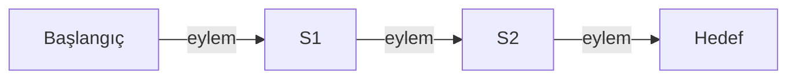
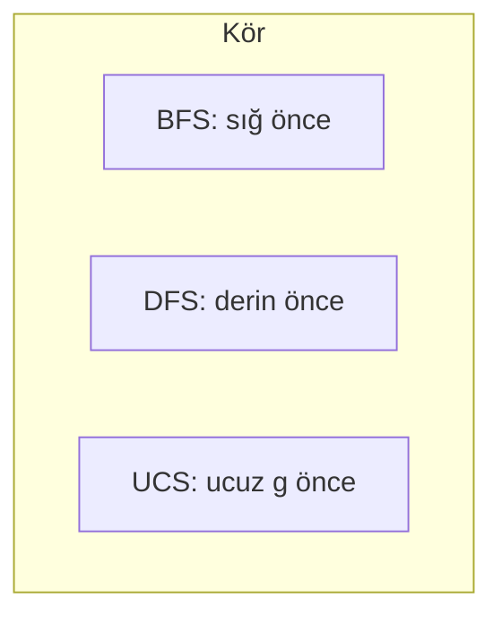
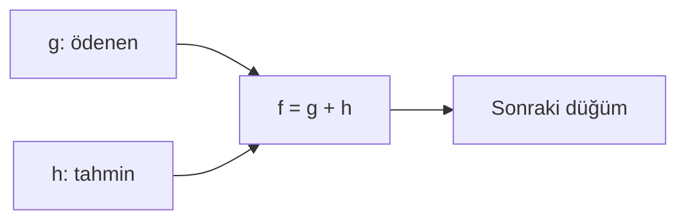

# Bölüm 3 — Çözüm arama: Özgün Notlar

> Bu notlar kitabın metninin kopyası değildir. Kavramları Türkçe, kendi cümlelerimizle öğretir.

---

## 1. Problem çözme = arama

Hedefe dayalı ajan “ne yapmalıyım?” sorusunu çoğu zaman şöyle yanıtlar: olası eylem dizilerini **dene** (zihinde veya simülasyonda), hedefe götüreni seç. Bu süreç **arama**dır.

Arama için önce problemi net formüle ederiz.

---

## 2. Problem formülasyonu (altı parça)

| Parça | Soru | Romanya örneği |
|-------|------|----------------|
| **Durum uzayı** | Ne temsiller? | Şehir (düğüm) |
| **Başlangıç** | Nereden? | Arad |
| **Eylemler** | Durumda ne yapılabilir? | Komşu şehre git |
| **Geçiş modeli** | Eylem sonrası yeni durum? | Arad —(yol)→ Sibiu |
| **Hedef testi** | Bitti mi? | şehir == Bucharest |
| **Yol maliyeti** | Ne kadar pahalı? | Yol km toplamı |

İyi formülasyon = gereksiz ayrıntıyı at, kararı etkileyen bilgiyi tut.



---

## 3. Ağaç arama vs graf arama

- **Ağaç arama:** Aynı duruma farklı yollarla tekrar gelebilirsiniz; sonsuz döngü riski (A↔B).
- **Graf arama:** Ziyaret edilen (veya “keşfedilen”) durumları kaydeder; aynı durumu yeniden genişletmez.

Gerçek hayatta çoğu zaman **graf arama** kullanırız. `romania_arama.py` graf arama tarzındadır (ziyaret kümesi).

---

## 4. Kör arama (bilgi yok)

Sezgisel yok: sadece problem tanımı.

### 4.1 BFS — genişlik öncelikli

- Kuyruk (FIFO): önce sığ, sonra derin.
- Birim maliyetli eylemlerde **en az adımlı** yolu bulur.
- Bellek: sınır büyük olabilir.

### 4.2 DFS — derinlik öncelikli

- Yığın (LIFO) veya özyineleme: bir dalı sonuna kadar iner.
- Bellek ucuz olabilir; yol **optimal olmak zorunda değil**; kötü dalda uzun süre takılabilir.
- Derinlik sınırı / yinelemeli derinleşme pratikte sık kullanılır (bu dosyada sade DFS).

### 4.3 UCS — tekdüze maliyet (Uniform Cost Search)

- Öncelik: şimdiye kadarki yol maliyeti **g(n)** en küçük olan.
- Değişken maliyetlerde **optimal** yol (maliyet ≥ 0 varsayımı).
- Birim maliyette BFS’e benzer davranış.



---

## 5. Bilgilendirilmiş arama

Hedefe “ne kadar kaldı?” tahmini: **sezgisel h(n)**.

### 5.1 Açgözlü (greedy) best-first

- Öncelik: sadece **h(n)** (hedefe tahmini kalan).
- Hızlı olabilir; **optimal değil**; kötümser/iyimser sezgiselde yanılabilir.

### 5.2 A*

- Öncelik: **f(n) = g(n) + h(n)**  
  - g: şimdiye kadar ödenen  
  - h: tahmini kalan
- **Kabul edilebilir (admissible) sezgisel:** h(n) gerçek kalan maliyeti **asla abartmaz** (h ≤ h*).
- Graf aramada ek olarak tutarlılık (consistency) koşulları konuşulur; sezgi: iyi h ile A* hem yönlendirir hem (uygun koşullarda) optimal kalır.

Romanya’da Bucharest’e **kuş uçuşu (SLD)** mesafeleri klasik kabul edilebilir sezgisel örneğidir (yol ağı kuş uçuşundan kısa olamaz).



---

## 6. Ne zaman hangisi?

| İhtiyaç | Algoritma |
|---------|-----------|
| En az adım (birim maliyet) | BFS |
| Bellek çok kısıtlı, optimal şart değil | DFS (dikkatli) |
| Değişken maliyet, optimal | UCS |
| İyi sezgisel var, optimal | A* |
| Hızlı yaklaşık | Greedy |

Ölçütler: **tamlık** (bulursa bulur mu?), **optimallik**, **zaman**, **bellek**.

---

## 7. Kodla pekiştirme

```bash
python ornekler/romania_arama.py
```

Çıktıda her algoritma için: yol, toplam maliyet, genişletilen düğüm sayısı. BFS ile A*’ı, UCS ile A*’ı karşılaştırın: aynı optimal maliyeti daha az genişletmeyle bulmak A*’ın tipik kazancıdır (iyi h ile).

---

## 8. Çalışma ipuçları

1. Yeni problemde önce altı parçalı formülasyonu yaz.
2. “Maliyet birim mi, değişken mi?” → BFS mi UCS/A* mı.
3. Sezgisel uydururken “abartıyor muyum?” diye sor (kabul edilebilirlik).
4. Genişletilen düğüm = “ne kadar iş yaptık” ölçütü; sadece yolu ezberleme.

Sonraki: Bölüm 4 — yerel arama, karmaşık / kısmi gözlem ortamları.

Resmi site: [aima.cs.berkeley.edu](https://aima.cs.berkeley.edu/) · Kod: [aimacode](https://github.com/aimacode)
