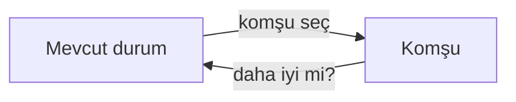

# Bölüm 4 — Karmaşık ortamlarda arama: Özgün Notlar

> Bu notlar kitabın metninin kopyası değildir. Kavramları Türkçe, kendi cümlelerimizle öğretir.

---

## 1. Neden “yerel” arama?

Bölüm 3’te yol buluyorduk: Arad’dan Bucharest’e hangi şehirler. Bazı problemlerde ise **yolun kendisi önemsiz**; sadece iyi bir *durum* isteriz.

Örnekler: bir takvimde çakışmasız atama, vezirleri tahtaya çatışmasız yerleştirme, bir rotanın toplam uzunluğunu küçültme. Durum uzayı çok büyük olabilir; tüm yolları saklamak pahalıdır.

**Yerel arama** tek (veya birkaç) mevcut duruma bakar, komşularına adım atar. Bellek ucuz; eksisi: optimali garanti etmez, yerel tepeye takılabilir.

---

## 2. Tepe tırmanma (hill climbing)

Fikir basit: komşular arasından **değerini en çok iyileştireni** seç; iyileşme kalmayınca dur.

- **Avantaj:** Hızlı, az bellek.
- **Riskler:**
  - **Yerel maksimum:** Gerçek zirve değil ama etrafta daha iyi yok.
  - **Plato:** Komşular aynı değerde; yön kaybolur.
  - **Sırt:** Dar bir iyi bölge; rastgele adımsız kolay kaçırılır.

**Rastgele yeniden başlatma:** Takılınca rastgele yeni başlangıç; en iyi sonucu sakla. Pratikte N-vezir gibi problemlerde çok işe yarar (`tepe_tirmanma_n_queens.py`).

Metrik örneği (N-vezir): *saldırı sayısı* (aynı satır/sütun/çaprazda çakışan çiftler). Hedef = 0 saldırı.

---

## 3. Simüle tavlama (simulated annealing)

Metal tavlama metaforu: yüksek “sıcaklıkta” kötü adımlar da kabul edilir; soğudukça sadece iyileşmeler kalır.

Algoritma sezgisi:

1. Rastgele bir komşu dene.
2. İyileşme → kabul et.
3. Kötüleşme → olasılıkla kabul et: sıcaklık yüksekken kolay, düşükken zor.
4. Sıcaklığı zamanla düşür (soğuma çizelgesi).

Böylece erken aşamada yerel tepelerden kaçma şansı artar; sonra arama “sıkılaşır”. `simule_tavlama_demo.py` küçük bir gezgin satıcı (TSP) örneği gösterir.

---

## 4. Genetik algoritma — sezgi

Bir *popülasyon* (birçok aday çözüm) tutarsın:

- **Seçilim:** Daha iyi bireyler daha sık ebeveyn olur.
- **Çaprazlama:** İki ebeveynden yeni birey.
- **Mutasyon:** Küçük rastgele bozulma (çeşitlilik).

Tepe tırmanma “tek dağcı”ysa, GA “bir sürü dağcı + gen alışverişi” gibidir. Ayrıntılı kod bu bölümde zorunlu değil; fikir yeter: popülasyon + seçilim + çeşitlilik.

---

## 5. Yerel ışın araması (local beam)

k tane durum birden tut. Her adımda hepsinin komşularını üret; en iyi k komşuyu seç. k=1 → klasik tepe tırmanma.

Fark: İyi bir “ışın” diğerlerini besleyebilir; tamamen bağımsız k yeniden başlatmadan daha bilgili bir paylaşım vardır. Aşırı benzer ışınlar çeşitliliği öldürebilir — o zaman rastgelelik veya çeşitlilik cezası düşünülür.

---

## 6. Belirsizlik ve kısmi gözlem — inanç durumu

Ortam deterministik ve tam gözlemlenebilir değilse tek bir “gerçek durum” bilmiyoruz.

- **Belirsiz eylem sonucu** (nondeterministik): Aynı eylem birden fazla duruma götürebilir.
- **Kısmi gözlem:** Sensör her şeyi göstermez.

**İnanç durumu (belief state):** Olası gerçek durumların *kümesi* (veya olasılık dağılımı). Arama artık tek durum değil, bu küme üzerinde ilerler: “Hangi eylemi seçersem, hangi gözlemle inancım nasıl daralır?”

Sezgi: Karanlık bir odada anahtarı aramak — her hareketten sonra “neredeyse emin olduğum yerler” kümesini güncellersin. Tam AND-OR / kontenjan plan detayı ileri okuma; burada amaç fikri içselleştirmek.

---

## 7. Çevrimiçi vs çevrimdışı arama

| | Çevrimdışı | Çevrimiçi |
|---|------------|-----------|
| Ne yapar? | Planı baştan hesaplar, sonra uygular | Eylemi dünyada yaparken öğrenir / keşfeder |
| Model | Geçiş modeli genelde biliniyor | Model eksik veya pahalı; denemek gerekir |
| Risk | Plan eskimiş kalabilir | Keşif maliyeti, tuzağa düşme |
| Örnek | Haritayı bilip A* çalıştırmak | Bilinmeyen labirentte duvara çarparak yol bulmak |

Çevrimiçi ajan **güvenli keşif** ister: geri dönülebilir durumları tercih etmek, “ölü çıkmaz”a girmemek. LRTA* gibi yöntemler “öğrenirken ara” fikrini taşır; isimleri ezberlemek şart değil, ayrımı bilmek önemli.

---

## 8. Kısa özet

- Yol değil durum kalitesi → **yerel arama**.
- Tepe tırmanma hızlı ama yerel tepeye takılır; **yeniden başlatma** yardımcı olur.
- **Tavlama** kötü adımlara kontrollü izin verir.
- **GA / ışın** çoklu adaylarla çeşitlilik arar.
- Belirsizlikte **inanç durumu**; keşifte **çevrimiçi** arama.

Sonraki bölüm (5): aynı arama fikri, ama karşıda **rakip** var — minimax ve alpha-beta.
