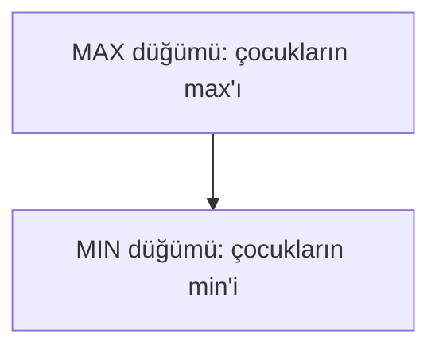

# Bölüm 5 — Rakip arama: Özgün Notlar

> Bu notlar kitabın metninin kopyası değildir. Kavramları Türkçe, kendi cümlelerimizle öğretir.

---

## 1. Neden “rakip” arama?

Bölüm 3–4’te ortam çoğunlukla *bizimle işbirliği yapmayan ama bize karşı da oynamayan* bir dünyaydı. Oyunlarda ise ikinci bir ajan **bilerek** bizi engellemeye çalışır.

Klasik çerçeve (bu bölümün omurgası):

- **İki oyuncu**, sırayla hamle
- **Deterministik** kurallar
- **Sıfır toplam:** birinin kazancı diğerinin kaybı
- **Mükemmel bilgi:** tahta herkese açık (XOX, satranç; poker değil)

Amaç: rakip de en iyi oynuyormuş gibi varsayarak kendi hamleni seçmek.

---

## 2. Oyun ağacı ve utility

Her düğüm bir tahta; çocuklar yasal hamleler. Yapraklarda oyun biter → sayısal **utility** (fayda), genelde MAX açısından: +1 galibiyet, 0 beraberlik, −1 mağlubiyet.

- **MAX** (ör. X): utility’yi büyütmek ister
- **MIN** (ör. O): utility’yi küçültmek ister (MAX’ın gözünden)

---

## 3. Minimax

Kökten yaprağa kadar (veya teoride tüm ağaç):

1. Yaprakta utility’yi döndür.
2. MAX düğümünde çocuk değerlerinin **maksimumunu** al.
3. MIN düğümünde çocuk değerlerinin **minimumunu** al.

Kökteki en yüksek değerli hamle “optimal” hamledir — **her iki taraf da kusursuz oynarsa**.

XOX gibi küçük oyunlarda ağacın tamamı taranabilir (`minimax_tictactoe.py`). Satrançta imkânsızdır → derinlik sınırı gerekir.

---

## 4. Alpha-beta budama

Minimax ile **aynı sonucu** üretir; sadece bazı dalları ziyaret etmez.

Sezgi:

- MAX zaten elinde iyi bir seçenek biliyorsa, MIN’in daha da kötüleştireceği bir alt ağacı gezmenin anlamı yoktur.
- **α (alpha):** MAX’ın şimdiye kadarki en iyi (en yüksek) garantisi
- **β (beta):** MIN’ın şimdiye kadarki en iyi (en düşük) garantisi
- α ≥ β olunca o dal **budanır**

Hamle sırası iyiyse (önce güçlü hamleler) budama oranı artar. Kötü sırada kazanç azdır.

---

## 5. Değerlendirme fonksiyonu ve kusurlu karar

Derin ağaçlarda yaprağa inemeyiz. O zaman:

1. Sabit **derinlik** veya zaman sınırı koy.
2. Kesilen düğümde **değerlendirme fonksiyonu** `eval(durum)` kullan: “bu tahta MAX için ne kadar iyi görünüyor?”

Bu **kusurlu karardır**: sezgisel skor yanlış yönlendirebilir; ufuk etkisi (horizon effect) gibi tuzaklar vardır. Yine de satranç motorlarının temeli budur: minimax/α-β + iyi eval + açılış/son oyun bilgisi.

XOX’ta eval’e gerek yok; oyun küçük. Ama fikir: “tam çözüm yoksa yaklaşık skorla karar ver.”

---

## 6. Kısa pratik notlar

- Beraberlik mümkünse utility 0’ı unutma.
- Sıra kimde? Durum temsiline “sıradaki oyuncu”yu ekle.
- Alpha-beta doğru uygulanırsa minimax ile bitiş utility’si aynıdır; sadece hız farkı.
- Stohastik oyunlar (zar) veya eksik bilgi (poker) bu notların dışında — beklenen değer / inanç durumu köprüsü sonraki okumalara.

---

## 7. Özet

| Kavram | Tek cümle |
|--------|-----------|
| Minimax | MAX max, MIN min; rakip en iyi oynar varsayımı |
| Alpha-beta | Aynı sonuç, daha az düğüm |
| eval | Derinlik bitince sezgisel skor |
| Kusurlu karar | Zaman/derinlik sınırı + eval |

Sonraki bölüm (6): kısıt sağlama — “rakip” yok, ama değişkenler ve kısıtlar var.
